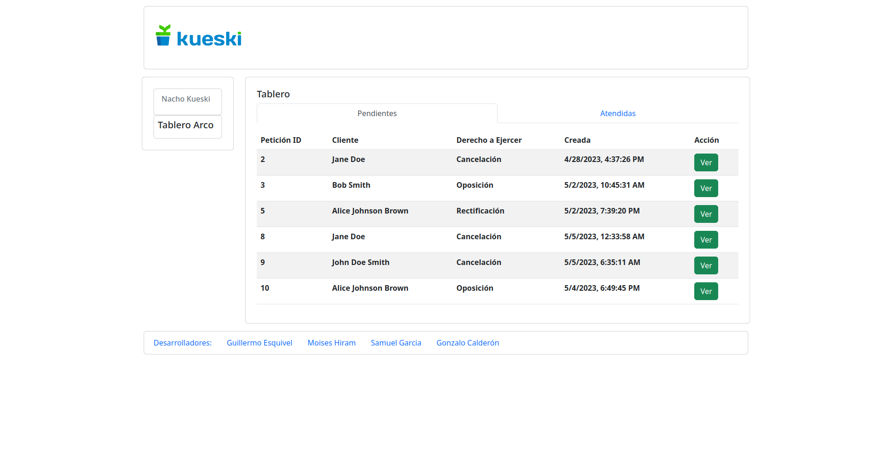
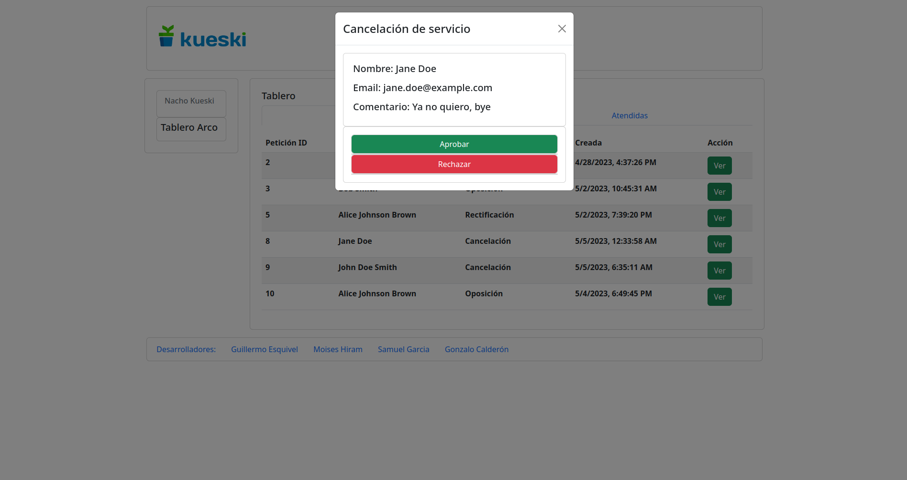
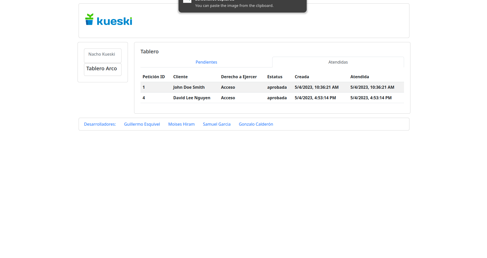
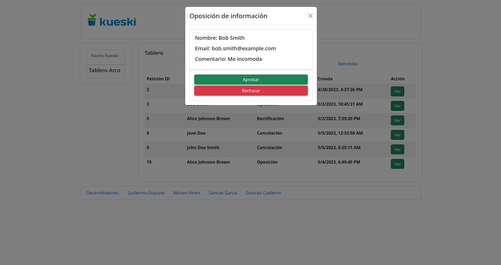
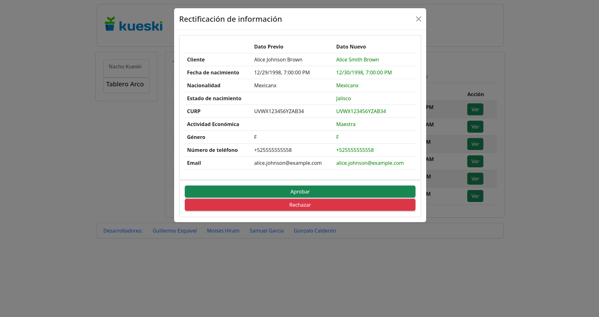

# Project Description
### ARCO Rights
These are the abbreviations for Access, Rectification, Cancellation and Opposition. The ARCO Rights are the set of rights through which the Organic Law for the Protection of Personal Data guarantees people the power to control their personal data in Mexico.
This is a RESTful API web to solve the solicitudes of the clients for the company Kueski.

# How to Install and Run the Project
In order to run the Frontend locally, it is necessary to go to /Front and first execute the command:
``` bash
npm install
```
After that, you can run it into the port 3000
``` bash
npm run dev
```

## How it looks:
 
 
 
 
